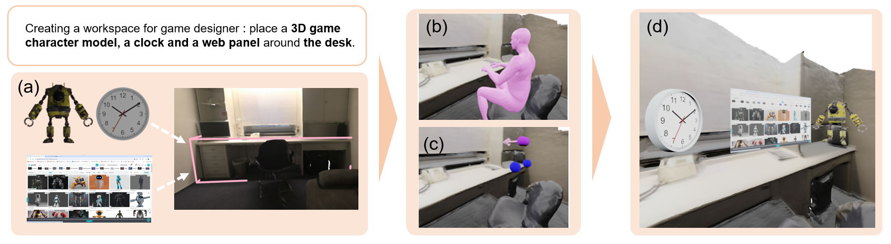

# ICAR : Interaction-Centric Automatic Layout Generation for AR Elements
We present ICAR, a novel Interaction Centric automatic layout generation framework for AR elements. Our key idea is to use the critical role of human interaction in layout generation for
AR elements.


## Description

This repository contains the viewpoint estimation, layout generation and data processing code used for the experiments in `ICAR`.

## Installation 
To install the necessary dependencies run the following command:
```shell
    pip install -r requirements.txt
```
## Get Started
```
git clone https://github.com/Evenwang521/ICAR.git
cd src
```
## Scenes Preparation
### PROX
Please download according to [POSA](https://posa.is.tue.mpg.de/) if using PROX dataset. Then transform it to the coordinate of POSA using the data process procedure.
```
cd data_process
cd PROX
python prox2posa.py
```
### Self-defined Scenes
If you want to run ICAR in self-defined scenes, we provide a simple reconstruction pipeline and data processing procedure to compute the SDF with semantic labels. 

You can find 3D models of the objects in real environments and manually arranged them in Blender accoring to the physical layouts. Then you can use ran the following scripts with specific parameters modification.
```
cd data_process
cd self-defined
python transform_export.py # get the transformation of all the ojects
python get_scene_aabb.py # get the axis-aligned bouding boxes of all objects
python get_scene_sdf.py # get sdf with semantic labels
```
We also provide visualization code and you can visualize the generated sdf. We presented our rencontructed scenes used in Scenario 1 and 2.


## Viewpoint Estimation
we provide an examples of how to estimate viewpoint for target object  `0` in scene `S1_E1`. 
```
python ./population.py --config ../cfg_files/contact_semantics.yaml --checkpoint_path $POSA_dir/trained_models/contact_semantics.pt --pkl_file_path $POSA_dir/POSA_rp_poses/rp_ethan_posed_012_0_0.pkl --scene_name S1_E1 --render True --viz True --target_object 0 --show_init_pos True --use_cuda True --use_semantics 1
```
This will open a window showing all the cuiling initial positions for the specified `pkl` file. Then a window showing the final results will be opened.

It also render the results and save them.

If you don't have a screen, you can turn off the visualization `--viz 0`.

If you don't have CUDA installed then you can add this flag `--use_cuda 0`. This applies to all commands in this repository.

## Layout Generation
we provide an examples of how to generate layout for AR elements in Scenario `1` for scene `S1_E1` with the viewpoint estimated from posed_body `rp_ethan_posed_012_0_0_00_00`. 
```
python ./layout.py --scene_name S1_E1 --body_name rp_ethan_posed_012_0_0_00_00 --scenario 1
```

